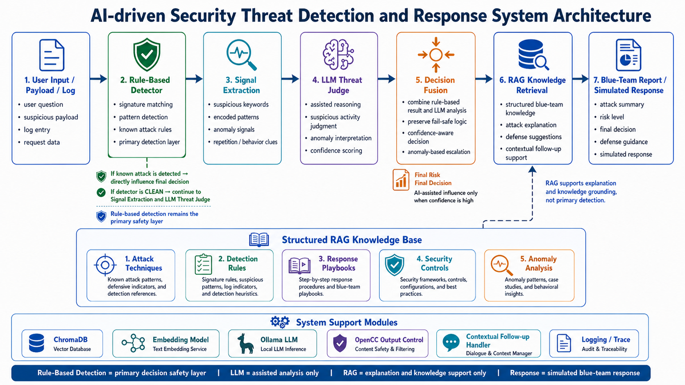
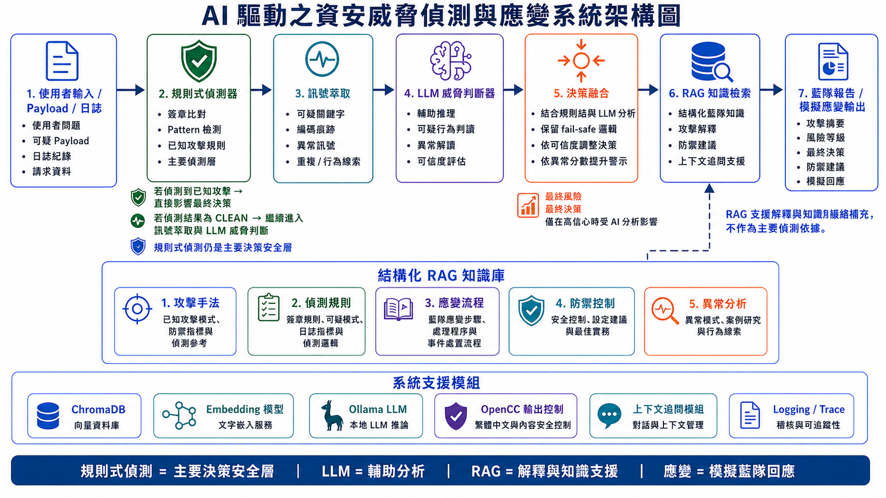

# AI-Assisted Blue-Team Security Triage Prototype

[](https://github.com/jasonwang1211/security-ai-agent/actions/workflows/ci.yml)

[English](#english) | [繁體中文](#繁體中文)

## English

This project is an AI-assisted blue-team security triage prototype. It helps analysts review suspicious payloads, translate individual raw log lines, ingest and aggregate log files, ask RAG-based security knowledge questions, and read results through a unified `Security Triage Report`.

The system is a defensive academic prototype. It does not attack real targets or control real security infrastructure.

For detailed evaluation notes and CLI excerpts, see:

- [Demo & Evaluation Report](REPORT.md)
- [Demo Outputs](demo_outputs.md)

### Key Features

| Feature | Purpose |
|---|---|
| Rule-Based Detector | Detects known payload attacks such as XSS, SQL Injection, and Path Traversal. |
| SecurityAgent | Coordinates detector output, triage policy, RAG context, and optional LLM assistance. |
| TriagePolicy | Owns risk scoring, decision mapping, and simulated defense policy. |
| LLMAssist | Provides alert explanation and suspicious behavior suggestions while leaving decisions to the system flow. |
| Consolidated Log Pipeline | `modules/log_pipeline.py` parses, normalizes, aggregates, adapts, and translates log inputs. |
| CLI Mode Handlers | `modules/mode_handlers.py` contains the lightweight CLI mode wrappers used by `app.py`. |
| RAGQueryPlanner | Plans security knowledge queries and supports preferred source selection. |
| RAG Knowledge Q&A | Answers defensive security questions using local knowledge and retrieval. |
| Pydantic Boundary Types | `modules/types.py` defines gradual boundary models for future controller and tool registry work. |
| Unified Security Triage Report | Presents triage results in one consistent report format. |
| Simulated Defense Decision | Produces simulated `BLOCK`, `MONITOR`, or `ALLOW` decisions. |

### Current Flow

```text
User Input
-> CLI Mode Handler
-> SecurityAgent
-> Rule-Based Detection / Log Pipeline / RAGQueryPlanner
-> TriagePolicy
-> LLMAssist
-> Unified Security Triage Report
```

Mode-specific paths:

```text
Payload / event analysis
-> Rule-Based Detector
-> TriagePolicy
-> Security Triage Report

Single raw log triage
-> log_pipeline.py
-> SecurityAgent
-> Security Triage Report

Log file triage
-> log_pipeline.py
-> SecurityAgent
-> Security Triage Report

Security knowledge Q&A
-> RAGQueryPlanner
-> Preferred Source Selection / Chroma Retrieval
-> RAG Answer
```

### System Architecture



Core modules:

- `app.py`: interactive CLI entry point
- `modules/mode_handlers.py`: CLI mode orchestration
- `modules/agent.py`: `SecurityAgent` coordination layer
- `modules/detector.py`: rule-based payload detection
- `modules/triage_policy.py`: risk, decision, and simulated defense policy
- `modules/llm_assist.py`: optional LLM-assisted explanation and suspicious behavior advice
- `modules/log_pipeline.py`: raw log parsing, normalization, aggregation, adaptation, and translation
- `modules/rag_query_planner.py`: RAG query planning and source preference selection
- `modules/rag_qa.py`: local knowledge retrieval and answer generation
- `modules/types.py`: Pydantic boundary types

### CLI Modes

```text
1. Payload / event analysis
2. Log file ingestion demo
3. Security knowledge Q&A
4. Follow-up / more details
0. Exit
```

### Safety Boundaries

- Rule-Based Detector is the primary decision layer for known payload detection.
- RAG is for explanation and knowledge support only.
- LLMAssist provides suggestions only.
- The resulting `Decision` is produced by the system flow.
- `BLOCK`, `MONITOR`, and `ALLOW` are simulated decisions.
- The system does not control real firewalls, WAF, EDR, cloud policies, or production response systems.
- This is a defensive academic prototype.

### Testing And Quality Checks

Install development dependencies:

```powershell
pip install -r requirements-dev.txt
```

Run tests, lint, and gradual typing checks:

```powershell
python -m pytest
python -m ruff check .
python -m mypy app.py modules tests
```

The test suite uses dummy RAG and LLMAssist objects, so it does not start the full app or initialize Chroma, embeddings, Torch, Ollama, or local LLM clients. GitHub Actions CI runs the same quality gate.

### Local Model Prerequisites

Ollama should be installed and running locally before using the CLI.

Required local models:

- `qwen2.5:7b`
- `gemma4:e4b`

Pull them with:

```bash
ollama pull qwen2.5:7b
ollama pull gemma4:e4b
```

Exact model names can be changed in `config.py`.

### How To Run

Create and activate a virtual environment:

```powershell
python -m venv venv
.\venv\Scripts\Activate.ps1
```

Install dependencies:

```bash
pip install -r requirements.txt
```

Prepare the local RAG knowledge base:

```bash
python ingest_knowledge.py
```

Run the CLI:

```bash
python app.py
```

### Current Status

Current working branch:

```text
v1.1.4-event-to-agent-adapter
```

Current milestone:

```text
v1.1.5-unified-triage-rag-routing
```

Completed:

- Unified `Security Triage Report`
- Raw log translation
- `auth_failure` triage
- Brute force candidate triage
- `RAGQueryPlanner`
- Mode 3 dedicated knowledge QA route
- Pydantic boundary types for gradual controller and tool registry work
- Golden smoke tests, focused boundary model tests, `ruff`, lenient `mypy`, and GitHub Actions CI

### Future Work

- Smart Input Router / Main Controller Agent
- Lazy initialization
- JSON incident report export
- More realistic log formats
- Web dashboard
- Hybrid multi-agent architecture
- Red / blue simulation lab

## 繁體中文

### 專案簡介

本專案是一個 AI 輔助的藍隊安全分流原型，協助分析可疑 payload、轉換單筆原始日誌、匯入並聚合日誌檔案、回答以 RAG 為基礎的資安知識問題，並以統一 Security Triage Report 呈現結果。

這是一個防禦導向的學術原型，不會攻擊真實目標，也不會控制真實安全基礎設施。

詳細評估紀錄與 CLI 範例可參考：

- [Demo & Evaluation Report](REPORT.md)
- [Demo Outputs](demo_outputs.md)

### 主要功能

| 功能 | 說明 |
|---|---|
| Rule-Based Detector | 偵測 XSS、SQL Injection、Path Traversal 等已知 payload 攻擊。 |
| SecurityAgent | 協調偵測結果、TriagePolicy、RAG context 與 LLMAssist 輔助資訊。 |
| TriagePolicy | 負責風險評估、決策對應與模擬防禦策略。 |
| LLMAssist | 提供告警解釋與可疑行為建議，但不取代系統流程決策。 |
| Consolidated Log Pipeline | `modules/log_pipeline.py` 負責日誌解析、正規化、聚合、轉接與轉譯。 |
| CLI Mode Handlers | `modules/mode_handlers.py` 負責 `app.py` 使用的 CLI 模式包裝。 |
| RAGQueryPlanner | 規劃資安知識查詢，並支援偏好知識來源選擇。 |
| RAG Knowledge Q&A | 使用本地知識庫與檢索結果回答防禦性資安問題。 |
| Pydantic boundary types | `modules/types.py` 提供逐步導入的邊界型別基礎，支援未來 ControllerAgent 與 Tool Registry 工作。 |
| 統一 Security Triage Report | 以一致格式呈現分流分析結果。 |
| 模擬防禦決策 | 產生模擬的 `BLOCK`、`MONITOR` 或 `ALLOW` 決策。 |

### 目前流程

```text
使用者輸入
-> CLI 模式處理器
-> SecurityAgent
-> 規則式偵測 / 日誌管線 / RAGQueryPlanner
-> TriagePolicy
-> LLMAssist
-> 統一 Security Triage Report
```

模式流程：

```text
Payload / event analysis
-> Rule-Based Detector
-> TriagePolicy
-> Security Triage Report

Single raw log triage
-> log_pipeline.py
-> SecurityAgent
-> Security Triage Report

Log file triage
-> log_pipeline.py
-> SecurityAgent
-> Security Triage Report

Security knowledge Q&A
-> RAGQueryPlanner
-> Preferred Source Selection / Chroma Retrieval
-> RAG Answer
```

### 系統架構



主要模組：

- `app.py`：互動式 CLI 入口
- `modules/mode_handlers.py`：CLI 模式協調
- `modules/agent.py`：`SecurityAgent` 協調層
- `modules/detector.py`：規則式 payload 偵測
- `modules/triage_policy.py`：風險、決策與模擬防禦策略
- `modules/llm_assist.py`：選用的 LLM 輔助解釋與可疑行為建議
- `modules/log_pipeline.py`：原始日誌解析、正規化、聚合、轉接與轉譯
- `modules/rag_query_planner.py`：RAG 查詢規劃與偏好來源選擇
- `modules/rag_qa.py`：本地知識檢索與回答生成
- `modules/types.py`：Pydantic boundary types

### CLI 模式

```text
1. Payload / event analysis
2. Log file ingestion demo
3. Security knowledge Q&A
4. Follow-up / more details
0. Exit
```

### 安全限制

- Rule-Based Detector 是已知 payload 偵測的主要判斷層。
- RAG 只負責解釋與知識支援。
- LLMAssist 只提供輔助建議。
- 最終 Decision 由系統流程產生。
- `BLOCK` / `MONITOR` / `ALLOW` 都是模擬決策。
- 系統不控制真實 firewall、WAF、EDR 或 cloud policies。
- 本專案是防禦導向的學術原型。

### 測試與品質檢查

安裝開發相依套件：

```powershell
pip install -r requirements-dev.txt
```

執行 pytest / ruff / mypy：

```powershell
python -m pytest
python -m ruff check .
python -m mypy app.py modules tests
```

測試使用 dummy RAG 與 LLMAssist 物件，不會啟動完整 CLI，也不會初始化 Chroma、embeddings、Torch、Ollama 或本地 LLM client。GitHub Actions CI 會執行同一組品質檢查。

### 目前狀態

目前分支：

```text
v1.1.4-event-to-agent-adapter
```

目前里程碑：

```text
v1.1.5-unified-triage-rag-routing
```

已完成：

- 統一 Security Triage Report
- 原始日誌轉譯
- `auth_failure` 分流
- brute force candidate 分流
- `RAGQueryPlanner`
- Mode 3 專用知識問答路由
- Pydantic boundary types 基礎
- golden smoke tests、boundary model tests、`pytest`、`ruff`、寬鬆 `mypy` 與 GitHub Actions CI

### 未來規劃

- Smart Input Router / Main Controller Agent
- Lazy initialization
- JSON incident report export
- 更真實的日誌格式
- Web dashboard
- Hybrid multi-agent architecture
- Red / blue simulation lab
