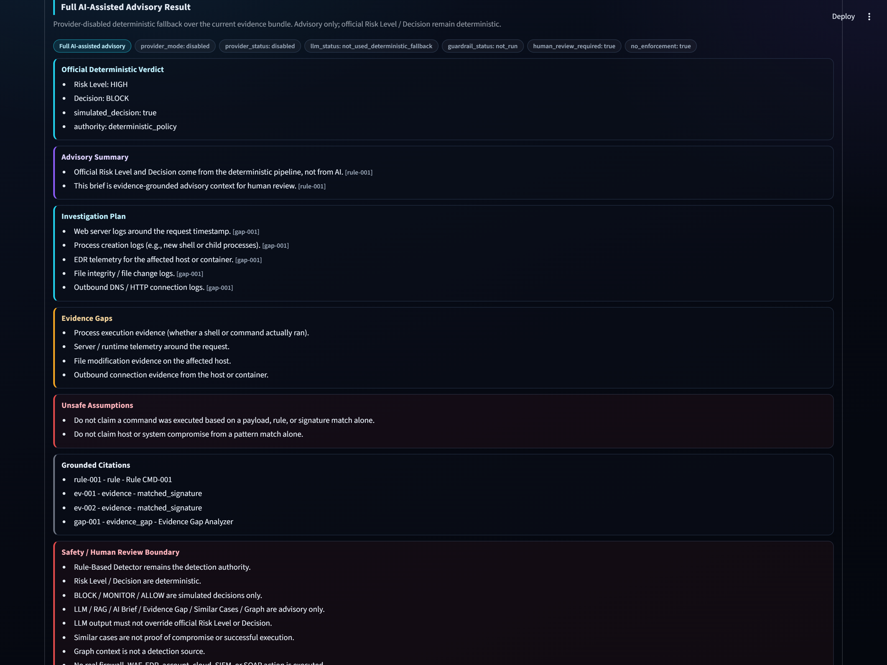
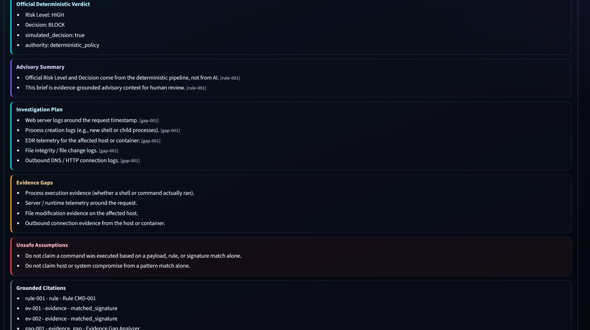
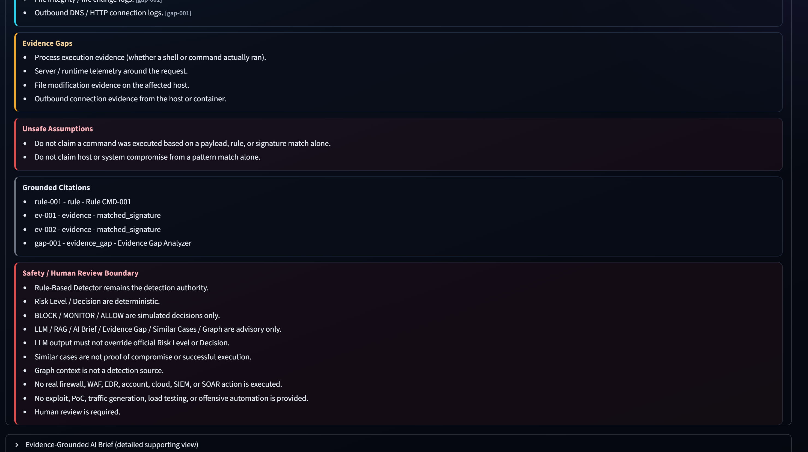
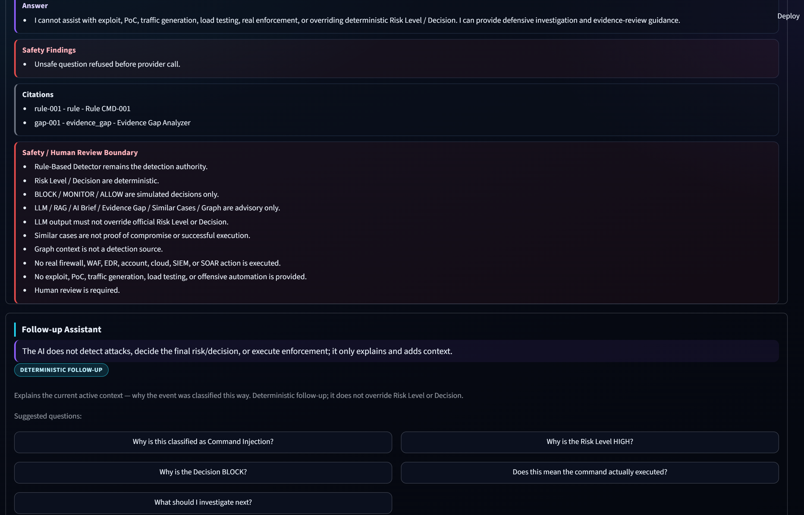
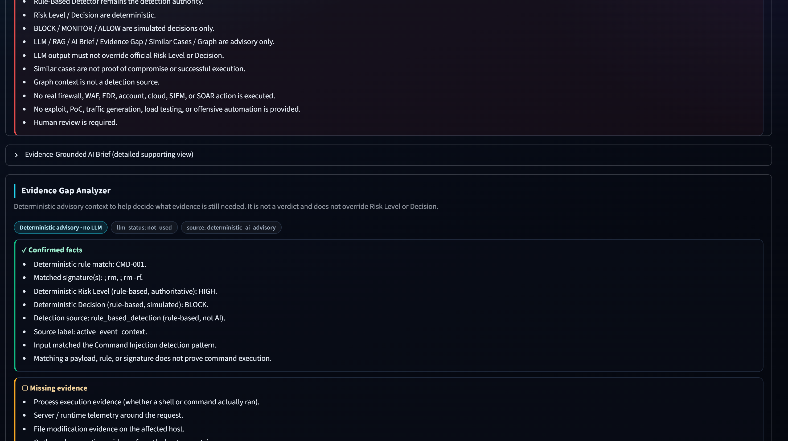
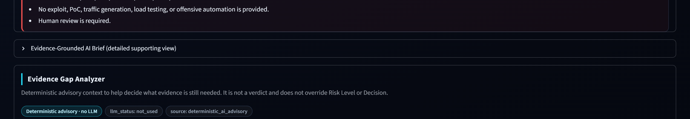

# Sentinel Project - AI-Assisted Blue-Team Security Triage

Sentinel Project is an AI-assisted blue-team security triage prototype. It implements a SOC-style Streamlit analyst console where supported inputs are classified by rule-based logic, assigned deterministic Risk Level / Decision values, and enriched with optional AI/RAG advisory context. The AI features are visible in the workflow, but they do not own the verdict path.

The repository is written for project review, demo walkthroughs, and portfolio discussion. It is not a production IDS/IPS, not a red-team tool, and not an autonomous response system.

## Screenshot Showcase

The console is the main demo surface: scenario cards, language and mode controls, deterministic analysis output, and visible safety framing. A typical Command Injection run (`test; rm -rf /tmp/test`) produces a deterministic verdict: Risk HIGH, simulated Decision BLOCK, backed by rule evidence CMD-001. Console overview, deterministic result, and HTTP/2 safe-demo screenshots remain available in the [screenshot gallery](docs/screenshots/README.md).

### v3.2 Full AI-Assisted Showcase

The v3.2 AI Analyst tab makes the Full AI-Assisted Advisory Result the main visible AI panel. It still uses the provider-disabled deterministic fallback path for the public showcase and CI: the official Risk Level / Decision are copied from deterministic policy, provider status is visible, and AI/RAG/Similar Cases/Graph context remains advisory only.

The main panel shows the official deterministic verdict first, followed by provider/LLM/guardrail status, advisory summary, investigation plan, evidence gaps, citations, unsafe assumptions, and the safety boundary.

Provider mode/status, LLM status, and guardrail status are visible. This screenshot path uses `provider_mode: disabled`; it does not claim live-provider behavior.

The advisory output focuses on investigation planning and missing evidence rather than claiming execution or compromise.

Event-Aware Q&A answers against the current evidence bundle and refuses unsafe requests such as exploit/PoC generation, traffic generation, real enforcement, or verdict override.

Similar Cases and Graph context are cited as advisory context only: similar cases are not proof of compromise, and Graph is not a detection source.

The existing Evidence-Grounded AI Brief remains available as a collapsed detailed supporting view, not as a second official verdict source.

See the [screenshot gallery](docs/screenshots/README.md) for the full v3.2 `40`-series English and Traditional Chinese screenshot set.

The HTTP/2 Resource Exhaustion safe synthetic demo remains part of the public demo path: Risk MEDIUM, simulated Decision MONITOR (rule HTTP2-RES-001), no traffic generation, and no real enforcement.

## Core Capabilities

| Capability | What it shows | Authority level |
|---|---|---|
| Rule-Based Detector | Reproducible classification for supported payload and incident patterns. | Detection authority |
| Deterministic Risk / Decision | Deterministic Risk Level plus simulated BLOCK / MONITOR / ALLOW. | Decision authority |
| Fast deterministic mode | Quick demo path without optional AI/RAG warm-up. | Deterministic path |
| Full AI-assisted mode | Optional AI/RAG explanation path with provider-disabled deterministic fallback for the public showcase. | Advisory only |
| Full AI-Assisted Advisory Result | v3.2 structured advisory panel with official verdict copy, provider status, investigation plan, evidence gaps, citations, and guardrail status. | Advisory only |
| AI Analyst Brief | Event summary, why it matters, next steps, unsafe assumptions. | Advisory only |
| Evidence-Grounded AI Brief | Cited, structured brief over deterministic evidence, gaps, and optional similar-case / graph context, with a deterministic fallback. | Advisory only |
| Evidence Gap Analyzer | Confirmed facts, missing evidence, recommended checks. | Advisory only |
| Event-Aware Q&A | Current-event questions answered from the active evidence bundle with unsafe-question refusal. | Advisory only |
| Knowledge Q&A / RAG | Defensive knowledge answers from approved context. | Advisory only |
| Approved Similar Cases | Read-only comparison against hand-curated approved seed cases; not proof of compromise. | Advisory only |
| Relationship Graph | Visual context for event, rule, risk, decision, and case links; not a detection source. | Advisory only |
| Case Draft / Markdown Export | Human-reviewed report material. | Human review required |

## Quick Start

~~~powershell
git clone https://github.com/jasonwang1211/security-ai-agent.git
cd security-ai-agent
python -m venv venv
.\venv\Scripts\Activate.ps1
pip install -r requirements.txt
python -m streamlit run ui/streamlit_app.py --server.fileWatcherType none
~~~

Recommended first demo path:

1. Select Fast deterministic mode.
2. Load Command Injection Demo or HTTP/2 Resource Exhaustion Suspicion.
3. Click Run input.
4. Review deterministic classification, Risk Level, and simulated Decision.
5. Open AI Analyst, Case Intelligence, Draft / Export, and the screenshot gallery as needed.

## Documentation

Start with the documentation hub: [docs/README.md](docs/README.md).

| Need | Read |
|---|---|
| Formal project report | [REPORT.md](REPORT.md) |
| Demo operation and troubleshooting | [User operation guide](docs/USER_OPERATION_GUIDE.md) |
| Step-by-step UI walkthrough | [UI walkthrough](docs/UI_WALKTHROUGH.md) |
| Screenshots / feature gallery | [Screenshot gallery](docs/screenshots/README.md) |
| Validation evidence | [Test report](docs/TEST_REPORT.md), [v2.9 release gate](docs/v2.9_release_gate.md), and [v2.9 release notes](docs/v2.9_release_notes.md) |
| Technical architecture notes | [Technical notes](docs/TECH_NOTES.md) |
| Roadmap | [Roadmap](docs/ROADMAP.md) |
| Traditional Chinese materials | [zh-TW overview](docs/zh-TW/README.zh-TW.md) and [zh-TW report](docs/zh-TW/PROJECT_REPORT.zh-TW.md) |

## Validation Summary

Latest v3.2 branch validation record:

- pytest: `1289 passed`
- ruff: passed
- mypy: passed, no issues found in 184 source files
- git diff --check: passed

Validation is organized around deterministic authority, bounded demo behavior, UI/helper contracts, provider fallback behavior, and safety-boundary regression control. These checks support demo correctness; they do not prove production IDS/IPS effectiveness, live SOC effectiveness, production traffic coverage, real enforcement effectiveness, or live-provider quality.

### Test Coverage / Validation Matrix

| Area | What is verified | Why it matters |
|---|---|---|
| Deterministic detection and triage policy | Rule-based classification, deterministic Risk Level / Decision, and HIGH -> BLOCK / MEDIUM -> MONITOR / LOW -> ALLOW style policy behavior. | Keeps the official verdict path reproducible; does not prove production IDS/IPS effectiveness. |
| Evidence bundle and Evidence-Grounded AI Brief | Official verdict, rule IDs, evidence IDs, citation IDs, evidence gaps, and unsafe assumptions are preserved in structured advisory output. | Prevents AI/report text from becoming the source of truth. |
| AI guardrails and safety boundary | Verdict override, Similar Cases-as-proof, Graph-as-detection-source, enforcement wording, exploit / PoC / traffic generation / load testing are blocked or fall back. | Keeps AI/RAG/Graph/Similar Cases advisory-only. |
| v3.1 Full AI-assisted foundation | Prompt contract, disabled default provider, fake test injection, optional local/openai-compatible modes, invalid JSON, missing citations, provider failures, and exceptions. | CI requires no live LLM, API key, Ollama, Chroma, embeddings, or network access. |
| v3.2 Full AI-assisted UI showcase | Full AI panel rendering, provider-disabled fallback status, Event-Aware Q&A, collapsed Evidence-Grounded supporting view, and stale context clearing. | Public screenshots use deterministic fallback and do not claim live-provider quality. |
| Event-aware Q&A backend | Answers use current deterministic context, evidence gaps, optional RAG, Similar Cases, and Graph context; unsafe questions are refused before provider calls. | Enables incident-aware questions without allowing AI to alter the verdict or perform enforcement. |
| Similar Cases and Relationship Graph | Similar Cases remain advisory comparisons; Graph remains read-only explanatory context. | Historical cases do not prove compromise, and Graph is not a detection source. |
| RAG / Knowledge Q&A controls | RAG is optional, advisory, lazy-loaded where applicable, and unavailable/no-answer paths degrade safely. | Retrieval context does not modify the official verdict. |
| UI helper / Streamlit smoke paths | Key helper paths and AppTest smoke flows, including Run -> Find Similar Cases -> case-001 / graph-001. | Supports demo workflow confidence; does not prove production deployment readiness. |
| Documentation / release-gate consistency | Validation wording, screenshot references, release notes, and safety-boundary language stay aligned. | Keeps public review material consistent; does not replace manual review. |

## Safety Boundary

- Rule-Based Detector is the detection authority.
- Risk Level / Decision are deterministic.
- BLOCK / MONITOR / ALLOW are simulated decisions only.
- RAG / LLM / AI Analyst Brief / Evidence-Grounded AI Brief / Evidence Gap Analyzer / Similar Cases / Relationship Graph provide advisory context only and do not override the official Risk Level or Decision.
- Approved Similar Cases are comparison context only and do not prove current compromise or successful execution.
- Relationship Graph context is for explanation only and is not a detection source.
- No live LLM client is required for the public Streamlit showcase or CI validation; the v3.2 screenshotted Full AI-Assisted Advisory Result path uses provider-disabled deterministic fallback. v3.1/v3.2 backend provider contracts are optional, disabled by default, and require separate manual smoke testing before being presented as live-provider behavior.
- No real firewall / WAF / EDR / account / cloud / SIEM / SOAR action is performed.
- No exploit code, PoC generation, traffic generation, or offensive automation is provided.
- Human review is required.

## Limitations

Sentinel Project is not a production IDS/IPS, not a real blocking engine, not an exploit generator, and not a replacement for SIEM, SOAR, EDR, vulnerability management, or incident response approval.

Future work is tracked in [docs/ROADMAP.md](docs/ROADMAP.md).
