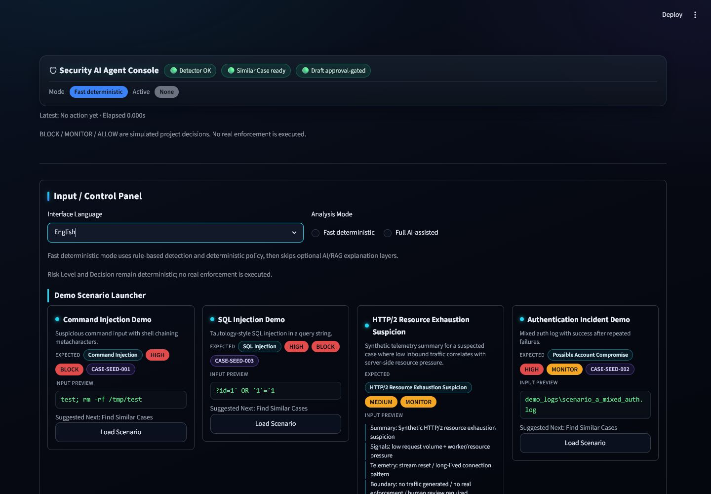
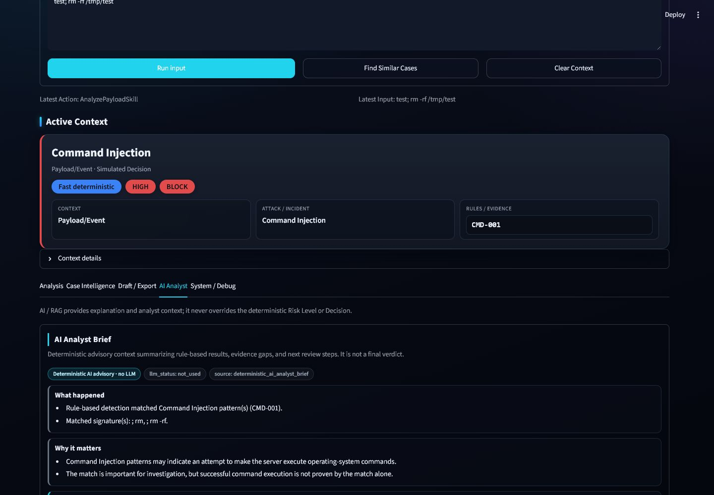
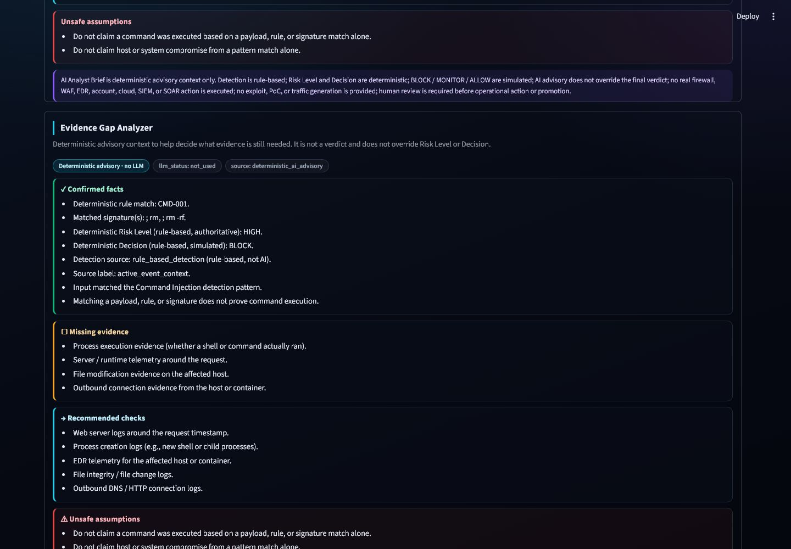
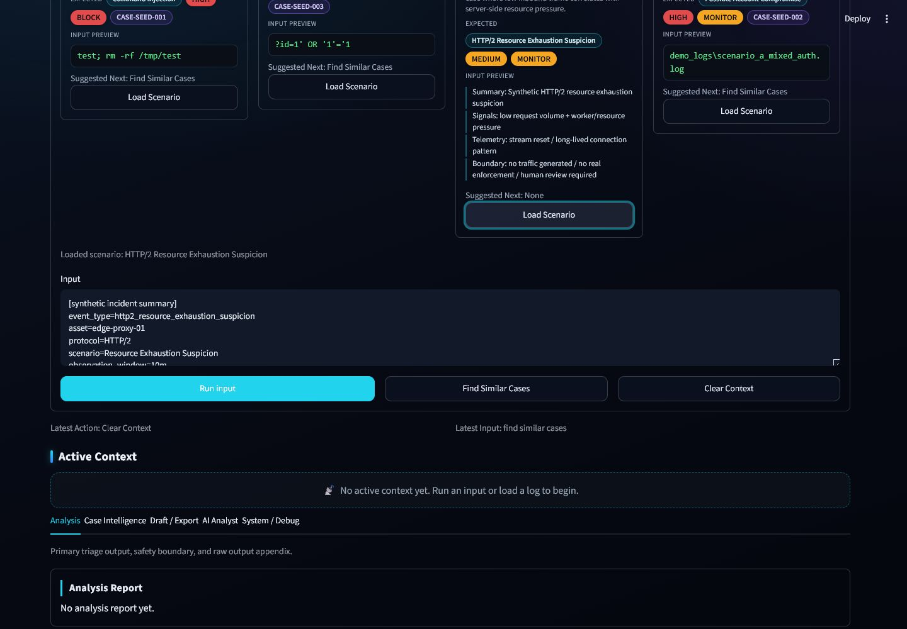

# Sentinel Project - AI-Assisted Blue-Team Security Triage

Sentinel Project is an AI-assisted blue-team security triage prototype. It implements a SOC-style Streamlit analyst console where supported inputs are classified by rule-based logic, assigned deterministic Risk Level / Decision values, and enriched with optional AI/RAG advisory context. The AI features are visible in the workflow, but they do not own the verdict path.

The repository is written for project review, demo walkthroughs, and portfolio discussion. It is not a production IDS/IPS, not a red-team tool, and not an autonomous response system.

## Screenshot Showcase

### Streamlit Analyst Console

The console is the main demo surface: scenario cards, language and mode controls, active context, deterministic results, and visible safety framing.

### AI Analyst Brief

The AI Analyst Brief explains the current event in analyst language while keeping the deterministic verdict separate from advisory context.

### Evidence Gap Analyzer

The Evidence Gap Analyzer separates confirmed facts, missing evidence, recommended checks, and unsafe assumptions.

### HTTP/2 Resource Exhaustion Safe Demo

The HTTP/2 scenario is a safe synthetic incident summary. It does not generate traffic, provide exploit steps, or claim real enforcement.

## Core Capabilities

| Capability | What it shows | Authority level |
|---|---|---|
| Rule-Based Detector | Reproducible classification for supported payload and incident patterns. | Detection authority |
| Deterministic Risk / Decision | Deterministic Risk Level plus simulated BLOCK / MONITOR / ALLOW. | Decision authority |
| Fast deterministic mode | Quick demo path without optional AI/RAG warm-up. | Deterministic path |
| Full AI-assisted mode | Optional AI/RAG explanation path. | Advisory only |
| AI Analyst Brief | Event summary, why it matters, next steps, unsafe assumptions. | Advisory only |
| Evidence Gap Analyzer | Confirmed facts, missing evidence, recommended checks. | Advisory only |
| Knowledge Q&A / RAG | Defensive knowledge answers from approved context. | Advisory only |
| Approved Similar Cases | Read-only comparison against approved seed cases. | Advisory only |
| Relationship Graph | Visual context for event, rule, risk, decision, and case links. | Advisory only |
| Case Draft / Markdown Export | Human-reviewed report material. | Human review required |

## Quick Start

~~~powershell
git clone https://github.com/jasonwang1211/security-ai-agent.git
cd security-ai-agent
python -m venv venv
.\venv\Scripts\Activate.ps1
pip install -r requirements.txt
python -m streamlit run ui/streamlit_app.py --server.fileWatcherType none
~~~

Recommended first demo path:

1. Select Fast deterministic mode.
2. Load Command Injection Demo or HTTP/2 Resource Exhaustion Suspicion.
3. Click Run input.
4. Review deterministic classification, Risk Level, and simulated Decision.
5. Open AI Analyst, Case Intelligence, Draft / Export, and the screenshot gallery as needed.

## Documentation

Start with the documentation hub: [docs/README.md](docs/README.md).

| Need | Read |
|---|---|
| Formal project report | [REPORT.md](REPORT.md) |
| Demo operation and troubleshooting | [User operation guide](docs/USER_OPERATION_GUIDE.md) |
| Step-by-step UI walkthrough | [UI walkthrough](docs/UI_WALKTHROUGH.md) |
| Screenshots / feature gallery | [Screenshot gallery](docs/screenshots/README.md) |
| Validation evidence | [Test report](docs/TEST_REPORT.md) and [v2.8 release gate](docs/v2.8_release_gate.md) |
| Technical architecture notes | [Technical notes](docs/TECH_NOTES.md) |
| Roadmap | [Roadmap](docs/ROADMAP.md) |
| Traditional Chinese materials | [zh-TW overview](docs/zh-TW/README.zh-TW.md) and [zh-TW report](docs/zh-TW/PROJECT_REPORT.zh-TW.md) |

## Validation Summary

Last recorded v2.8 release-gate validation summary:

- pytest: 1168 passed
- ruff: passed
- mypy: passed
- gitleaks: passed with .gitleaksignore false-positive handling
- screenshot language refresh: completed for English and Traditional Chinese screenshot sets

These checks validate demo behavior and safety-boundary regressions. They do not claim production IDS/IPS effectiveness.

## Safety Boundary

- Rule-Based Detector is the detection authority.
- Risk Level / Decision are deterministic.
- BLOCK / MONITOR / ALLOW are simulated decisions only.
- RAG / LLM / AI Analyst Brief / Evidence Gap Analyzer / Similar Cases / Relationship Graph provide advisory context only.
- No real firewall / WAF / EDR / account / cloud / SIEM / SOAR action is performed.
- No exploit code, PoC generation, traffic generation, or offensive automation is provided.
- Human review is required.

## Limitations

Sentinel Project is not a production IDS/IPS, not a real blocking engine, not an exploit generator, and not a replacement for SIEM, SOAR, EDR, vulnerability management, or incident response approval.

Future work is tracked in [docs/ROADMAP.md](docs/ROADMAP.md).
